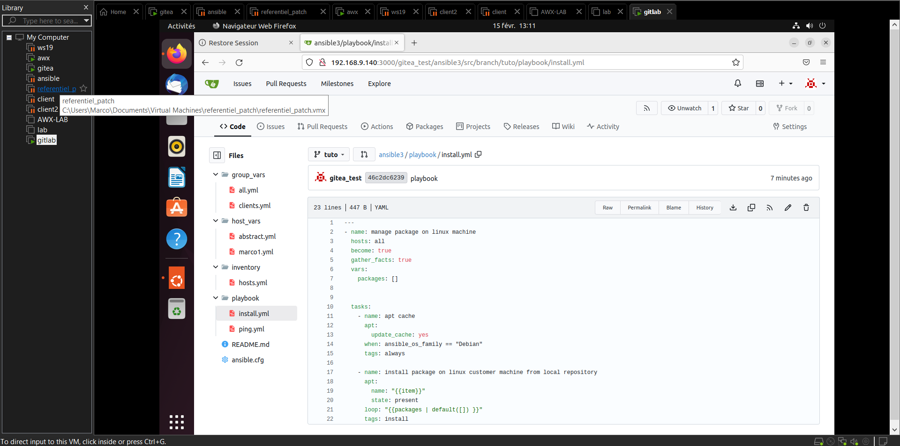

# 🚀 Déploiement de Gitea avec Docker-compose

Prise en main et utilisation de Gitea comme serveur Git auto-hébergé.

---

## 🎯 BUT

Déployer un serveur Gitea localement afin d’héberger et sécuriser différents projets sans dépendre d’une plateforme externe.

---

## 🚀 OJECTIFS

Assurer le versioning, la collaboration et l’automatisation de différents projets.

---

## 📊 DASHBOARD

---

## 🛠️ TECHNOLOGIES UTILISÉES

    Docker
    Docker Compose
    Git
    Linux

---

## 📫 CONTACT

