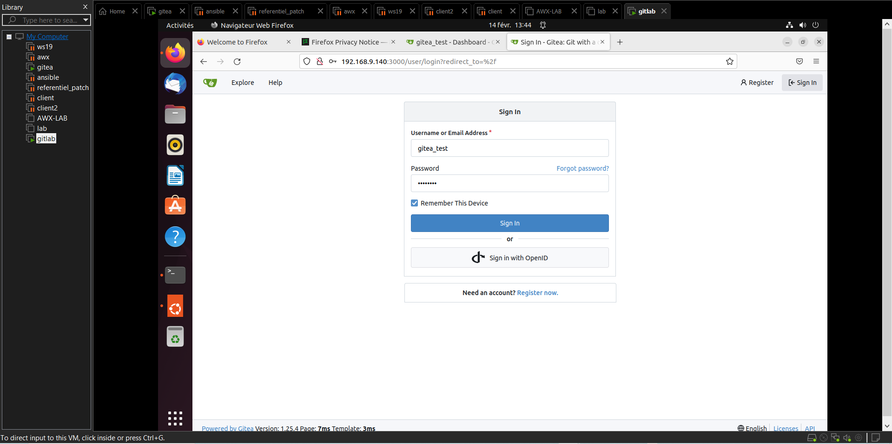

🚧🚧🚧__Projet en cours de restructuration.__

<h1 align="center">  Déploiement de Gitea avec Docker compose </h1>

<h2 align="center"> Prise en main et déploiement du serveur Gitea auto-hébergé. </h2>

---

## 🎯 A propos de l'outil

Gitea est une plateforme de gestion de code source et de collaboration tout-en-un facile à utiliser et auto-hébergé.
Etant un projet open source et léger,  il permet la révision, la collaboration, l'automatisation intégrée, etc... c'est un Comparable à Github, Gitlab, Bitbucket.

---

## Résultats attendus

L'objectif final ? Disposer d'une instance Gitea pleinement opérationnelle en local. Afin de permettre :

    1. La sécurité et la souveraineté : Pourquoi? Pour une révision de code, une collaboration et un déploiement de différents projets de manière interne, privée et totalement sécurisée.

    2. Une absence de dépendance extérieure : Permettre un fonctionnement autonome au sein d'une infrastructure locale et ce, de manière privée
    3. Utilisation de Traefik comme reverse proxy pour la détection automatique de différentes routes, rendre l'accès externe plus propre

---

##  🛠️ Prérequis

1. Système d'exploitation : Linux (de préférence) ou Windows
2. Disque et stockage : SSD 25GO
3. RAM : 4GO minimum
4. CONNECTIVITE : Bonne connectivité internet au départ 
5. ADRESSAGE IP : une adresse IP fixe
6. Git: Doit être installé pour clôner le projet sur le dépôt distant
7. OPENSSL: Permettre la création d'une clé publique et privée, la gestion de certificats, etc...
8. Docker Engine et docker compose : Permettre la conteneurisation et le déploiement des différents services de l'architecture.

---

## 📂 Structure du projet

```text
GITEA_DEPLOY/
├── certs/
|   └── nom_fichier.crt (exemple: local.crt)                   # Certificat SSL public
|   └── nom_fichier.key (exemple: local.key)                   # Clé privée SSL
├── DAT/
|   └── Déploiement du serveur Gitea avec docker-compose_.pdf  # Documentation complète du déploiement
|── dynamic/
|   └── tls.yml                                                # Configuration TLS dynamique pour Traefik
|
├── Images/                                                    # Captures d'écran et illustrations
├── gitea.yml                                                  # Fichier général de configuration (YML)
└── README.md                                                  # Description générale du projet
```
---

## 💾 Configuration et déploiement

   ### PARTIE 1: Installation de gitea avec docker-compose sans reverse proxy
   
        L'installation de gitea s'adapte en fonction de différentes organisations. Elle se fait généralement via (Docker,   Kubernetes, gestion de paquets, etc... ) Dans le cadre de projet, l'installation se fera avec Docker compose.

        S'assurer que docker et docker compose sont installés. Comment vérifier?

```bash
which docker && which docker compose

 ```
 ---

 ```bash
 docker --version && docker compose version

 ```

Si les deux éléments ne sont pas présents, passer à l'installation de Docker et docker compose.

 1. Installation de docker ([Documentation officielle](https://docs.docker.com/engine/install))
 2. Installation de docker-compose ([Documentation officielle](https://docs.docker.com/compose/install))

---

Installation du serveur Gitea

Au niveau de la home directory faire ce qui suit:

 ```bash
mkdir nom du dossier && cd nom du dossier

 ```
Exemple:

```bash
mkdir /home/marco/gitea && cd /home/marco/gitea

```

---
⚠️ Préparation du dossier avec les bons droits ($USER en cas de developpement local)
⚠️ Pour un developpement en production ? veuillez définir un utilisateur dédié

 ```bash
 sudo chown -R $USER:$USER chemin vers le dossier du travail

 ```
Exemple:

 ```bash
sudo chown -R $USER:$USER /home/marco/gitea

 ```
---
⚠️ Voir les différentes propriétés du répertoire dans lequel on travaille:

 ```bash
ls -la /home/marco/gitea

 ```

 ---

 ```bash
cd /home/marco/gitea

git clone git@github.com:jeanmarctsh/gitea_deploy.git

cd gitea_deploy

ls -al

## création de repertoires ci-dessous pour la persistance des données conformément aux éléments du fichier

mkdir lab_data lab_postgres 

# Exécution du fichier pour installer gitea comme serveur auto-hebergé

docker compose -f gitea.yml up -d

# Vérification de l'état du conteneur déployé

docker ps 

# Vérification des logs par rapport au fichier déployé (gitea.yml)

docker compose -f gitea.yml logs

# Vérification de l'accessibilité et l'exposition du serveur Gitea

curl -I http://IP-SERVEUR:3000/

# Accès via le navigateur web

ouvrir le navigateur et saisir l'élément suivant: http://IP-SERVEUR:3000/

 ```
voici un exemple d'accès sans reverse proxy:




   ### PARTIE 2: Configuration du routage dynamique en https avec Traefik comme reverse proxy

Prérequis:

1. docker engine + docker compose: Pour installer et configurer le service Traefik
2. Opennssl: Pour générer la paire de clé
3. htpasswd issu du paquet apache2-utils: Pour créer et gérer les fichiers de mots de passe pour l'authentification HTTP de  base

```bash
# Vérification de l'outil openssl et httppaswd (si absent? veuillez les installer)

which htpasswd 

which openssl

# si absent ? installer les via les commandes ci-dessous:

sudo apt install apache2-utils -y

sudo apt install openssl -y

cd /home/marco/gitea/gitea_deploy

mkdir certs dynamic

# création d'un utilisateur avec mot de passe chiffré pour le dashboard Traefik( Copier l'output qui sera affiché)

htpasswd -nb admin "P@ssw0rd" | sed -e 's/\$/\$\$/g' # ceci est un exemple, adapter le en fonction de vos besoins

# Génération d'une clé privée RSA de 2048 bits (local.key) et un certificat public X.509 auto-signé (local.crt) valable un an

Note: la commande sera exécutée au niveau de la home directory tout en indiquant le chemin complet 

openssl req -x509 -nodes -days 365 -newkey rsa:2048 \
  -keyout gitea_deploy/certs/local.key -out gitea_deploy/certs/local.crt \
  -subj "/CN=*.docker.localhost"


cd dynamic

touch tls.yml 

Le contenu et la structure de ce fichier sont disponibles ici : [consulter la configuration du fichier tls.yml](dynamic/tls.yml)

# une fois les étapes ci-dessus finalisées , veuilez mettre à jour le fichier gitea.yml via la commande:

docker compose -f gitea.yml up -d

# Voir l'état du conteneur déployé

docker ps
```

## Accessibilité au navigateur web

une fois la configuration faite, veuillez saisir les informations ci-dessous au niveau du navigateur web:


| ID | Service | URL d'accès | Description |
|:--:|:---|:---|:---|
| 1 | **Dashboard Traefik** | `https://dashboard.docker.localhost` | Accès dynamique au tableau de bord en HTTPS via Traefik |
| 2 | **Serveur Gitea** | `https://gitea.docker.localhost` | Accès dynamique au serveur Gitea en HTTPS via Traefik |

## Présentation visuelle 

l'utilisation de traefik pour les différents services déployés se présentent de la manière ci-dessous:

1. Pour la partie dashboard avec Traefik comme reverse proxy


2. Dashboard gitea déployé avec docker compose utilisant Traefik comme reverse proxy


---

## 📫 CONTACT

[](mailto:jeanmarctshimbombo@gmail.com)
[](https://www.linkedin.com/in/jean-marc-ngandu-b60796222)
[](https://github.com/jeanmarctsh)
   


